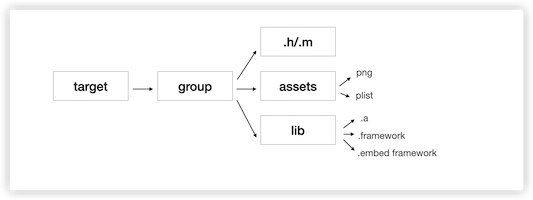

# ManuallyInsertCodes
Manullay insert codes by xcodeproj

# 为什么这么做？

　　现在有这么一个使用场景，基线能生成项目A，项目B，项目C...如果只有项目A中使用SDK_A，其他项目都不使用，这时候就需要对基线进行差分，只有当我切换到项目A时，才插入SDK_A。

　　不同于cocoapods的库管理方式，xcodeproj是通过脚本在编译前向项目中插入指定代码文件。

# Xcode中的项目结构

   

   项目中都会有个主target作为根节点，底下有很多group节点，这些group节点管理者三类文件

    1. 常规的 .h/.m 文件

    2. 资源文件

    3. 库文件，分为静态库.a文件、动态库.framework文件、阉割版的动态库embed franework文件

## 如何引入

　　这里涉及到xcodeproj的具体使用，贴一下官方文档：

　　https://www.rubydoc.info/gems/xcodeproj/Xcodeproj

   ```
    #获取项目
    $project = Xcodeproj::Project.open($project_path);

    #获取target，通常取第一个为项目的主target
    $target = $project.targets.first

    # 获取插件目录的group，如果不存在则创建
    $group_One = $project[$plugin_folder] || $project.main_group.find_subpath(File.join($plugin_folder), true);

    # 在目标目录新建group目录
    $group = $group_One.find_subpath($folderName, true)
    $SDK_PATH = $group_One.real_path.to_s + "/" + $plugin_folder + "/" + $folderName

    # 判断SDK_PATH目录下是否存在第三方代码，不存在则退出
    if !FileTest::exists?($SDK_PATH)
        puts "SDK file not found in #{$SDK_PATH}"
        exit 1
    end
   ```
　　* project_path 是项目的路径

　　* plugin_folder 是插入的目录名称，它是创建在项目目录底下的

　　* folder_name 是插入的第三方库的文件夹的名称，它是创建在plugin_folder目录底下的

　　

　　注意，这里的第三库的代码文件其实和项目的代码是放在一块的，我们要做的只是将它和项目关联起来，也就是在XXX.xcodeproj文件中添加其引用。具体的关联就是建立target底下的group组后 添加上述3类文件的引用。

　　1. .h/.m 文件添加引用

    ```
    if filePath.to_s.end_with?(".h") then
      fileReference = aGroup.new_reference(filePath);
      # aTarget.source_build_phase.add_file_reference(fileReference, true)
    elsif filePath.to_s.end_with?(".m", ".mm", ".cpp") then
      fileReference = aGroup.new_reference(filePath);
      aTarget.source_build_phase.add_file_reference(fileReference, true)
    ```
 　　需要注意的是.h文件只需要 在group底下new一个reference，.m文件需要将group底下的reference添加进source_build_phase

　　2. 资源文件添加引用

    ```
    if filePath.to_s.end_with?(".bundle",".plist" ,".xml",".png",".xib",".js",".html",".css",".strings")
      fileReference = aGroup.new_reference(filePath);
      aTarget.resources_build_phase.add_file_reference(fileReference, true)
    ```
 　　根据资源文件创建其group的reference后，需要将其添加进resources_build_phase

　　3. 库文件的引用

    ```
    if filePath.to_s.end_with?(".framework" ,".a")
      fileReference = aGroup.new_reference(filePath);
      build_phase = aTarget.frameworks_build_phase;
      build_phase.add_file_reference(fileReference);
      if $isEmbed == true
          #添加动态库
          $embed_framework.add_file_reference(fileReference)
          #勾上code sign on copy选项（默认是没勾上的）
          $embed_framework.files.each do |file|
              # puts "entry filePath : #{filePath} fileRef path : #{file.file_ref.path}"
              if filePath.end_with?(file.file_ref.path) then
                  if file.settings.nil? then
                      # puts "setting is nil"
                      file.settings = Hash.new
                  end
                  file.settings["ATTRIBUTES"] = ["CodeSignOnCopy", "RemoveHeadersOnCopy"]
              end
          end
    end
    ```
 　　库文件需将 reference 添加进frameworks_build_phase，如果是embed framework还需将其添加进embed_frameworks_build_phase，其在xcodeproj中的具体类型是PBXCopyFilesBuildPhase


## 如何清除

　　因为SDK_A仅仅是项目A使用，如果从项目A切换到项目B，此时就得从XXX.xcodeproj文件中清除关于SDK_A的所有引用，其实是添加引用的一个逆向工程。

　　上文中我们说到 将SDK_A插入{$PROJECT_PATH}/plugin_folder，所以只需遍历这个group，清除其中所有的reference即可。

    ```
    def removeBuildPhaseFilesRecursively(aTarget, aGroup)
      aGroup.files.each do |file|
          if file.real_path.to_s.end_with?(".m", ".mm", ".cpp") then
              aTarget.source_build_phase.remove_file_reference(file)
          elsif file.real_path.to_s.end_with?(".bundle",".plist" ,".xml",".png",".xib",".js",".html",".css",".strings") then
              aTarget.resources_build_phase.remove_file_reference(file)
          elsif file.real_path.to_s.end_with?(".framework" ,".a")
              aTarget.frameworks_build_phase.remove_file_reference(file)
              # remove embed ref
              if $isEmbed && !$embed_framework.nil?
                $embed_framework.remove_file_reference(file)
              end
          end

          # extra r+emove file ref
          file.remove_from_project
      end

      aGroup.groups.each do |group|
          # puts "group path : #{group.path}"
          if group.path == "embed"
              $isEmbed = true
          end
          removeBuildPhaseFilesRecursively(aTarget, group)
          $isEmbed = false
      end
    end
    ```
 　　* .m 文件的引用由source_build_phase移除

　　 * 资源文件的引用由resources_build_phase移除

　　 * 库文件的引用由frameworks_build_phase移除，其中embed的framework还需由embed_framework_build_phase额外移除一下

# 后记

　　xcodeproj 其实不光只是添加引用，xcode中的build_settings的所有选项几乎都可以通过xcodeproj的脚本控制，这里先按下不表。
